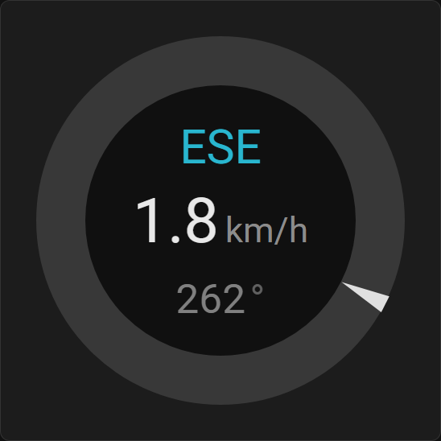
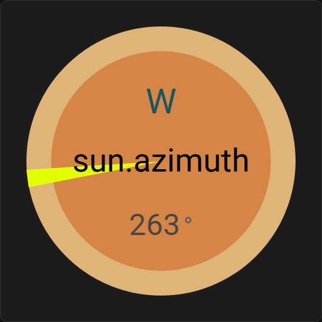
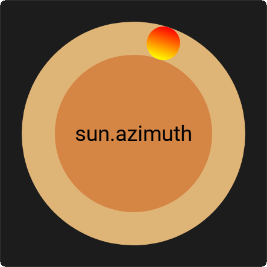

# Custom Compass Card

[](https://github.com/rob-vandenberg/custom-compass-card/releases)
[](https://github.com/hacs/integration)
[](https://opensource.org/licenses/MIT)

A fully configurable compass card for Home Assistant with dynamic fields and customizable arrows.

## Features
* Customizable compass with adjustable colors and sizes
* Dual arrow modes (inward/outward)
* Up to 3 configurable text fields with templates
* Support for transparency in colors (#RRGGBBAA)
* Fully responsive design that scales the compass to its container size

## Installation via HACS

### Add Custom Repository
1. Open HACS in your Home Assistant
2. Click the three dots menu in the top right
3. Select "Custom repositories"
4. Add the repository URL: `https://github.com/rob-vandenberg/custom-compass-card`
5. Select type: "Dashboard"
6. Click "Add"

### Install the Card
1. Open HACS in your Home Assistant
1. Search for "Custom Compass Card"
2. Click "Download"
3. When asked to reload click "RELOAD"


## Manual Installation

1. Download `custom-compass-card.js` from the [latest release](https://github.com/rob-vandenberg/custom-compass-card/releases)
2. Copy to `/config/www/custom-compass-card/` folder
3. Add to your Dashboard resources:
   ```yaml
   resources:
     - url: /local/custom-compass-card/custom-compass-card.js
       type: module
   ```
4. Restart Home Assistant


## Configuration

Add the card to your Lovelace dashboard:

```yaml
type: custom:custom-compass-card
compass_entity: sensor.wind_bearing
compass_adjustment: 0
background_color: '#101010'
circle_color: '#383838'
circle_width: 16
arrow_color: '#E0E0E0'
arrow_width: 3
arrow_height: 16
arrow_outward: true
arrow_inward: false
field_1_show: true
field_1_template: '${compass_direction}'
field_1_unit: ''
field_1_fontsize: 1.6
field_1_fontcolor: '#29B6CF'
field_1_unit_fontsize: 1.0
field_1_unit_fontcolor: '#196D7C'
field_2_show: true
field_2_template: "{{ states('sensor.wind_speed') | round(1) }}"
field_2_unit: 'km/h'
field_2_fontsize: 2.1
field_2_fontcolor: '#E8E8E8'
field_2_unit_fontsize: 1.2
field_2_unit_fontcolor: '#8C8C8C'
field_3_show: true
field_3_template: "{{ states('sensor.wind_direction') | round(0) }}"
field_3_unit: '°'
field_3_fontsize: 1.4
field_3_fontcolor: '#808080'
field_3_unit_fontsize: 1.4
field_3_unit_fontcolor: '#606060'
```

### Configuration Options

| Option | Type | Default | Description |
|--------|------|---------|-------------|
| `compass_entity` | string | **Required** | Entity ID for compass direction (0-360 degrees) |
| `compass_attribute` | string | `''` | Optional attribute name to use instead of entity state (e.g., 'azimuth' for sun.sun) |
| `compass_adjustment` | number | `0` | Bearing adjustment in degrees |
| `background_color` | string | `'#101010'` | Background color (supports #RRGGBBAA) |
| `circle_color` | string | `'#383838'` | Border color |
| `circle_width` | number | `16` | Border width in pixels |
| `arrow_color` | string | `'#E0E0E0'` | Arrow color (supports transparency) |
| `arrow_width` | number | `3` | Arrow width in pixels |
| `arrow_height` | number | `16` | Arrow height in pixels |
| `arrow_outward` | boolean | `true` | Show outward-pointing arrow |
| `arrow_inward` | boolean | `false` | Show inward-pointing arrow |
| `field_N_show` | boolean | `true` | Show field N (1, 2, or 3) |
| `field_N_template` | string | - | Jinja2 template or `${compass_direction}` |
| `field_N_unit` | string | - | Unit text to display |
| `field_N_fontsize` | number | - | Font size in em |
| `field_N_fontcolor` | string | - | Font color (supports transparency) |
| `field_N_unit_fontsize` | number | - | Unit font size in em |
| `field_N_unit_fontcolor` | string | - | Unit font color |

### Template Examples

**Compass direction:**
```yaml
field_1_template: '${compass_direction}'
```

**Entity value with rounding:**
```yaml
field_2_template: "{{ states('sensor.wind_speed') | round(1) }}"
```

**Custom Jinja2 template:**
```yaml
field_3_template: "{{ (states('sensor.wind_bearing') | float / 10) | round(0) }}"
```

### Using Entity Attributes

**Example: Sun azimuth (angle from north)**
```yaml
type: custom:custom-compass-card
compass_entity: sun.sun
compass_attribute: azimuth
```

**Example: Weather wind direction attribute**
```yaml
type: custom:custom-compass-card
compass_entity: weather.home
compass_attribute: wind_bearing
```

Leave `compass_attribute` empty to use the entity's state value directly.


## Support

If you find this card useful, please star the repository!

For issues and feature requests, please use the [GitHub Issues](https://github.com/rob-vandenberg/custom-compass-card/issues) page.


### Screenshots

| Default View | Sun Azimuth | Advanced Config |
| :---: | :---: | :---: |
|  |  |  |


## License

MIT License - see LICENSE file for details.
