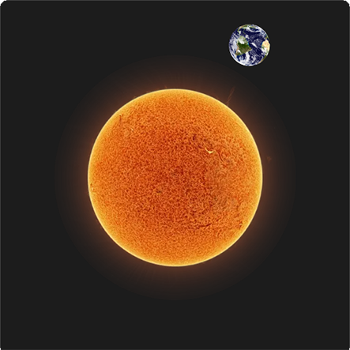
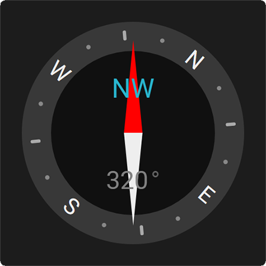
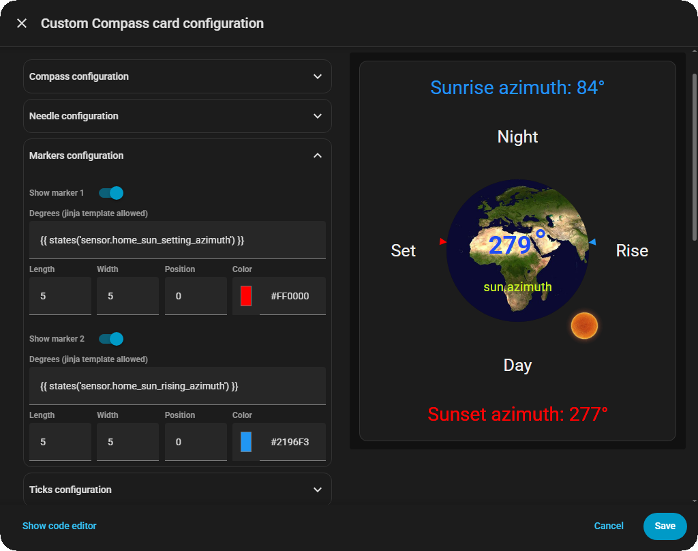

# Custom Compass Card

### A fully configurable compass card for Home Assistant

[](https://github.com/rob-vandenberg/custom-compass-card/releases)
[](https://github.com/hacs/integration)
[](https://opensource.org/licenses/MIT)

---

## What is the Custom Compass Card?

Custom Compass Card displays a compass on your Home Assistant dashboard, driven by any entity that provides a bearing in degrees — wind direction, sun azimuth, moon position, or anything else that rotates.

What makes it different from other compass cards is the level of visual control. The needle isn't just a fixed arrow — it's a parametric shape you can morph from a sharp triangle into a rounded needle, a perfect circle, a kite, or virtually anything in between. The border ring can be decorated with three tiers of tick marks, and optionally display localized cardinal labels. Up to three text fields sit inside the compass, and an optional header and footer can appear above and below it. All text fields support Jinja2 template expressions.

Custom Compass Card is very customizable. The same card, with different settings, can look like a wind speedometer, a compass or a sun tracker:

| Wind Speed | Compass |
| :----: | :----: |
|  |  |
| Earth orbits the Sun | Rotate Compass |
|  |  |

| UI Editor |
| :-------: |
|  |

Everything is configurable through the built-in visual editor — no YAML required.

---

## Installation via HACS

1. Open HACS in your Home Assistant
2. Click the three dots menu in the top right → **Custom repositories**
3. Add `https://github.com/rob-vandenberg/custom-compass-card` and select type **Dashboard**
4. Click **Add**, then search for **Custom Compass Card**
5. Click **Download** and reload when prompted

---

## Manual installation

1. Download `custom-compass-card.js` from the [latest release](https://github.com/rob-vandenberg/custom-compass-card/releases)
2. Copy it to `/config/www/custom-compass-card/`
3. Add it to your dashboard resources:

```yaml
resources:
  - url: /local/custom-compass-card/custom-compass-card.js
    type: module
```

4. Reload Home Assistant

---

## Getting started

Add the card to any Lovelace dashboard and point it at an entity:

```yaml
type: custom:custom-compass-card
compass_entity: sensor.wind_bearing
```

That's the minimum. The card opens the visual editor when you click the pencil icon, where you can adjust everything without touching YAML.

If your entity stores the bearing as an **attribute** rather than its state — like `sun.sun` which stores azimuth as an attribute — set `compass_attribute` as well:

```yaml
type: custom:custom-compass-card
compass_entity: sun.sun
compass_attribute: azimuth
```

---

## The needle

The needle shape is controlled by two parameters that work together.

### Morph

`needle_morph` moves the tail point of the needle, transforming its overall shape:

| Value | Shape |
|-------|-------|
| `0` | Triangle — the default arrow shape |
| negative | Arrow with a notch cut into the tail |
| `50` | Classic needle — tip and tail are symmetric, forming a diamond |
| `> 50` | Kite — tail extends outward past the base |

### Curve

`needle_curve` adds Bezier curvature to all edges:

| Value | Effect |
|-------|--------|
| `0` | Straight edges |
| `10–20` | Softly rounded |
| `≈27.6` | Perfect circle (requires `morph: 50` and equal width/height) |
| `50+` | Heavy bulge, crescent shapes |

> **Tip:** To create a perfect circle — useful for a sun or moon dot — set `needle_morph: 50`, `needle_curve: 27.6`, and make `needle_width` and `needle_height` equal.

The needle supports a two-color gradient, invert (swap tip and tail), and rotate (flip to the opposite side of the compass).

---

## Compass rotation

By default the compass dial is fixed and the needle rotates to point at the current bearing. Enabling **Rotate compass** inverts this: the needle stays fixed pointing north and the dial rotates beneath it, exactly like the heading indicator in an aircraft cockpit or a nautical chart compass.

This mode makes most sense when the entity represents a heading — a vehicle, vessel, or aircraft — where the question being answered is *"where am I pointed relative to north?"* rather than *"where is something pointing?"*

| Mode | Dial | Needle | Typical use |
|------|------|--------|-------------|
| Default | Fixed | Rotates to bearing | Wind direction, sun azimuth, any direction finder |
| Rotate compass | Rotates | Fixed north | Vehicle heading, vessel course, aircraft heading indicator |

The **Rotate needle** toggle continues to work in both modes — it flips the needle 180°, useful if the sensor reports the reciprocal bearing.

### Animation

All rotation — whether needle or dial — is animated with a smooth transition. The rotation always takes the shortest arc to the new bearing, so a change from 359° to 1° animates 2° counterclockwise rather than sweeping 358° the long way round. This matters especially for wind direction, which can shift by large amounts rapidly.

The transition duration defaults to 0.3 seconds and can be adjusted via YAML using `rotation_animation_time`.

---

## Tick marks

Three tiers of tick marks can be drawn around the border ring:

- **Major** — 4 marks at the cardinal positions (0°, 90°, 180°, 270°)
- **Minor** — 4 marks at the intercardinal positions (45°, 135°, 225°, 315°)
- **Micro** — 8 marks at the remaining 22.5° positions

Each tier has independent controls for visibility, length, stroke width, color, and position (how far in or out from the border edge they sit).

### Cardinal labels

As an alternative to major tick marks, the cardinal directions can be displayed as text labels by enabling the **Cardinal labels** toggle. The labels are fully localizable — you can set any text for each of the four cardinal points, so Dutch users can display N/O/Z/W instead of N/E/S/W, for example.

When cardinal labels are enabled, all 16 compass directions shown in the text fields are automatically derived from the four configured cardinal letters. So if you set North=N, East=O, South=Z, West=W, then NNE becomes NNO, SSE becomes ZZO, and so on.

Cardinal labels and major tick marks are mutually exclusive in the editor — enabling one automatically disables the other.

---

## Markers

Two markers can be placed on the compass dial at any fixed bearing. Each marker is an inverted triangle that points inward toward the center, sitting just outside the bezel edge by default.

Markers are useful for indicating a reference bearing — a target wind angle, a solar panel orientation, a waypoint direction, or any other fixed point of interest. Because markers live on the same layer as the tick marks, they behave identically in both rotation modes: they stay fixed on the dial in normal mode, and rotate with the dial in **Rotate compass** mode, which is exactly the correct behaviour for a fixed real-world bearing.

The two markers are independent and fully configurable. By default marker 1 is red and marker 2 is blue, but any color is accepted.

### Position

`marker_position` controls how far the marker sits from the bezel edge:

| Value | Effect |
|-------|--------|
| `0` | Tip of the triangle touches the bezel edge (default) |
| positive | Marker moves outward, away from the dial |
| negative | Marker moves inward, overlapping the bezel |

---

## Text fields

Three text fields can be displayed inside the compass at configurable vertical positions. Each field shows a value and an optional unit, with independent font size, font weight, and color controls for both the value and the unit.

Templates support the special `${compass_direction}` token, which automatically converts the current bearing to a 16-point compass direction:

```yaml
field_1_template: '${compass_direction}'
```

Standard Jinja2 expressions work too:

```yaml
field_2_template: "{{ states('sensor.wind_speed') | round(1) }}"
field_2_unit: 'km/h'
```

---

## Header and footer

An optional header and footer can be displayed above and below the compass circle. When hidden they take up no space — the card remains square. When shown the card grows taller to accommodate them.

Both header and footer support Jinja2 template expressions, the same as text fields.

---

## Full configuration reference

### Compass

| Option | Default | Description |
|--------|---------|-------------|
| `compass_entity` | `sun.sun` | Entity providing the bearing (0–360°) |
| `compass_attribute` | `azimuth` | Attribute to read. Leave empty to use the entity state |
| `compass_adjustment` | `0` | Degrees to add to the raw value before rendering |
| `compass_rotate` | `false` | Rotate the dial instead of the needle. See Compass rotation section |
| `rotation_animation_time` | `0.3` | Rotation transition duration in seconds. YAML only |
| `background_color` | `#101010` | Compass circle background. Supports `#RRGGBBAA` |
| `bezel_color` | `#383838` | Border ring color. Supports `#RRGGBBAA` |
| `bezel_width` | `16` | Border ring width |
| `bezel_size` | `0` | Adjusts the outer boundary. Positive = larger, negative = smaller |

### Needle

| Option | Default | Description |
|--------|---------|-------------|
| `needle_show` | `true` | Show or hide the needle |
| `needle_invert` | `false` | Swap tip and tail |
| `needle_rotate` | `false` | Rotate 180° |
| `needle_color_1` | `#FF0000` | Gradient start color. Supports `#RRGGBBAA` |
| `needle_color_1_pos` | `50` | Start color position (0–100%) |
| `needle_color_2` | `#EEEEEE` | Gradient end color. Supports `#RRGGBBAA` |
| `needle_color_2_pos` | `50` | End color position (0–100%) |
| `needle_height` | `100` | Needle height |
| `needle_width` | `10` | Needle width |
| `needle_position` | `-10` | Offset from center. Positive = outward, negative = inward |
| `needle_morph` | `50` | Tail shape. See Needle section above |
| `needle_curve` | `0` | Edge curvature. See Needle section above |

### Cardinal labels

| Option | Default | Description |
|--------|---------|-------------|
| `cardinals_show` | `false` | Show cardinal labels instead of major tick marks |
| `cardinal_north` | `N` | Label for North |
| `cardinal_east` | `E` | Label for East |
| `cardinal_south` | `S` | Label for South |
| `cardinal_west` | `W` | Label for West |
| `cardinals_fontsize` | `10` | Font size (SVG units) |
| `cardinals_fontweight` | `400` | Font weight (100–900, steps of 100) |
| `cardinals_position` | `1.5` | Offset from border edge |
| `cardinals_fontcolor` | `#EEEEEE` | Label color |

### Tick marks

Replace `major` with `minor` or `micro` for the other tiers.

| Option | Default | Description |
|--------|---------|-------------|
| `major_ticks_show` | `true` | Show or hide |
| `major_ticks_length` | `6` | Line length |
| `major_ticks_width` | `2` | Stroke width |
| `major_ticks_position` | `-3.5` | Offset from border edge. Negative = inward |
| `major_ticks_color` | `#CCCCCC` | Color |

Minor defaults: length `3`, width `1.5`, position `-4.5`, color `#AAAAAA`  
Micro defaults: length `0`, width `2`, position `-6.5`, color `#888888`

### Markers

Replace `1` with `2` for the second marker.

| Option | Default | Description |
|--------|---------|-------------|
| `marker_1_show` | `false` | Show or hide |
| `marker_1_degrees` | `30` | Fixed bearing in degrees (0–359) |
| `marker_1_length` | `5` | Triangle height |
| `marker_1_width` | `4` | Triangle base width |
| `marker_1_position` | `0` | Offset from bezel edge. Positive = outward, negative = inward |
| `marker_1_color` | `#FF0000` | Fill color. Supports `#RRGGBBAA` |

Marker 2 defaults: degrees `330`, color `#2196F3`

### Header and footer

Replace `header` with `footer` for the footer fields.

| Option | Default | Description |
|--------|---------|-------------|
| `header_show` | `false` | Show or hide. When false, takes up no space |
| `header_text` | `header` | Static text or Jinja2 template |
| `header_fontsize` | `2.0` | Font size in em |
| `header_fontweight` | `400` | Font weight (100–900, steps of 100) |
| `header_position` | `0` | Vertical offset in pixels |
| `header_fontcolor` | `#FFFFFF` | Text color |

### Text fields

Replace `1` with `2` or `3` for the other fields.

| Option | Default | Description |
|--------|---------|-------------|
| `field_1_show` | `true` | Show or hide |
| `field_1_template` | `${compass_direction}` | Static text, Jinja2, or `${compass_direction}` |
| `field_1_fontsize` | `1.5` | Font size in em |
| `field_1_fontweight` | `400` | Font weight (100–900, steps of 100) |
| `field_1_position` | `23` | Vertical position as % of compass height |
| `field_1_fontcolor` | `#29B6CF` | Text color. Supports `#RRGGBBAA` |
| `field_1_unit` | `''` | Unit text |
| `field_1_unit_fontsize` | `1.0` | Unit font size relative to field font size |
| `field_1_unit_fontweight` | `400` | Unit font weight (100–900) |
| `field_1_unit_fontcolor` | `#196D7C` | Unit color |

Field 2 defaults: hidden by default, position `50`  
Field 3 defaults: position `79`, fontsize `1.4`, fontcolor `#808080`

---

## Support

If you find this card useful, please star the repository!

For bugs and feature requests, use the [GitHub Issues](https://github.com/rob-vandenberg/custom-compass-card/issues) page.

---

## License

MIT License — see LICENSE file for details.
