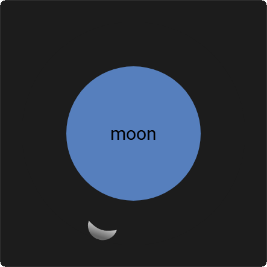
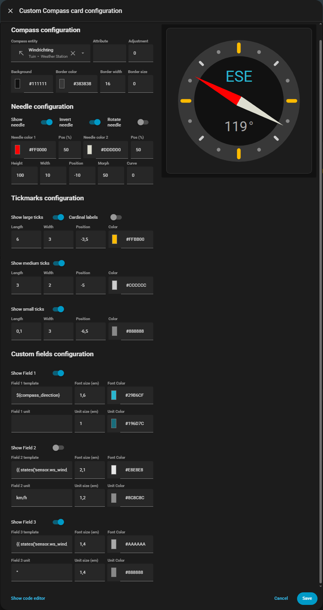

# Custom Compass Card

### A fully configurable compass card for Home Assistant

[](https://github.com/rob-vandenberg/custom-compass-card/releases)
[](https://github.com/hacs/integration)
[](https://opensource.org/licenses/MIT)

---

## What is the Custom Compass Card?

The Custom Compass Card displays a circular compass on your Home Assistant dashboard, driven by any entity that provides a bearing in degrees — wind direction, sun azimuth, moon position, or anything else that rotates.

What makes it different from other compass cards is the level of visual control. The needle isn't just a fixed arrow — it's a parametric shape you can morph from a sharp triangle into a rounded needle, a perfect circle, a kite, or virtually anything in between. The border ring can be decorated with three tiers of tick marks, and optionally display the cardinal points N, E, S, W as labels. Up to three text fields sit inside the compass and can display any entity value or Jinja2 template expression.

The same card, with different settings, can look like a wind speedomiter, a compass, a sun tracker, or a moon position indicator:

| Wind Speed | Compass |
| :----: | :----: |
|  |  |
| Sun | Moon |
|  |  | 

| UI Editor |
| :-------: |
|  |

Everything is configurable through the built-in visual editor — no YAML required.

---

## Installation via HACS

1. Open HACS in your Home Assistant
2. Click the three dots menu in the top right → **Custom repositories**
3. Add `https://github.com/rob-vandenberg/custom-compass-card` and select type **Dashboard**
4. Click **Add**, then search for **Custom Compass Card**
5. Click **Download** and reload when prompted

---

## Manual installation

1. Download `custom-compass-card.js` from the [latest release](https://github.com/rob-vandenberg/custom-compass-card/releases)
2. Copy it to `/config/www/custom-compass-card/`
3. Add it to your dashboard resources:

```yaml
resources:
  - url: /local/custom-compass-card/custom-compass-card.js
    type: module
```

4. Reload Home Assistant

---

## Getting started

Add the card to any Lovelace dashboard and point it at an entity:

```yaml
type: custom:custom-compass-card
compass_entity: sensor.wind_bearing
```

That's the minimum. The card opens the visual editor when you click the pencil icon, where you can adjust everything without touching YAML.

If your entity stores the bearing as an **attribute** rather than its state — like `sun.sun` which stores azimuth as an attribute — set `compass_attribute` as well:

```yaml
type: custom:custom-compass-card
compass_entity: sun.sun
compass_attribute: azimuth
```

---

## The needle

The needle shape is controlled by two parameters that work together.

### Morph

`needle_morph` moves the tail point of the needle, transforming its overall shape:

| Value | Shape |
|-------|-------|
| `0` | Triangle — the default arrow shape |
| negative | Arrow with a notch cut into the tail |
| `50` | Classic needle — tip and tail are symmetric, forming a diamond |
| `> 50` | Kite — tail extends outward past the base |

### Curve

`needle_curve` adds Bezier curvature to all edges:

| Value | Effect |
|-------|--------|
| `0` | Straight edges |
| `10–20` | Softly rounded |
| `≈27.6` | Perfect circle (requires `morph: 50` and equal width/height) |
| `50+` | Heavy bulge, crescent shapes |

> **Tip:** To create a perfect circle — useful for a sun or moon dot — set `needle_morph: 50`, `needle_curve: 27.6`, and make `needle_width` and `needle_height` equal.

The needle also supports a two-color gradient, invert (swap tip and tail), and rotate (flip to the opposite side of the compass).

---

## Tick marks

Three tiers of tick marks can be drawn around the border ring:

- **Large** — 4 marks at the cardinal positions (0°, 90°, 180°, 270°)
- **Medium** — 4 marks at the intercardinal positions (45°, 135°, 225°, 315°)
- **Small** — 8 marks at the remaining 22.5° positions

Each tier has independent controls for visibility, length, stroke width, color, and position (how far in or out from the border edge they sit).

### Cardinal labels

Large tick marks can be replaced by the letters **N**, **E**, **S**, **W** by enabling the **Cardinal labels** toggle. When active:

- `tick_large_length` controls the font size
- `tick_large_width` controls the font weight (the value is multiplied by 100 — so `4` = weight 400, `7` = weight 700 bold)
- `tick_large_color` controls the letter color
- `tick_large_position` adjusts how close the letters sit to the border ring

---

## Text fields

Three text fields can be displayed inside the compass at fixed vertical positions — top, center, and bottom. Each field shows a value and an optional unit.

Templates support the special `${compass_direction}` token, which automatically converts the current bearing to a 16-point compass direction (N, NNE, NE, ENE...):

```yaml
field_1_template: '${compass_direction}'
```

Standard Jinja2 expressions work too:

```yaml
field_2_template: "{{ states('sensor.wind_speed') | round(1) }}"
field_2_unit: 'km/h'
```

---

## Full configuration reference

### Compass

| Option | Default | Description |
|--------|---------|-------------|
| `compass_entity` | `sun.sun` | Entity providing the bearing (0–360°) |
| `compass_attribute` | `azimuth` | Attribute to read. Leave empty to use the entity state |
| `compass_adjustment` | `0` | Degrees to add to the raw value before rendering |
| `background_color` | `#101010` | Compass circle background. Supports `#RRGGBBAA` |
| `circle_color` | `#383838` | Border ring color. Supports `#RRGGBBAA` |
| `circle_width` | `16` | Border ring width |
| `border_size` | `0` | Adjusts the outer boundary. Positive = larger, negative = smaller |

### Needle

| Option | Default | Description |
|--------|---------|-------------|
| `needle_show` | `true` | Show or hide the needle |
| `needle_invert` | `false` | Swap tip and tail |
| `needle_rotate` | `false` | Rotate 180° |
| `needle_color_1` | `#E0E0E0` | Gradient start color |
| `needle_color_1_pos` | `0` | Start color position (0–100%) |
| `needle_color_2` | `#E0E0E0` | Gradient end color |
| `needle_color_2_pos` | `100` | End color position (0–100%) |
| `needle_height` | `16` | Needle height |
| `needle_width` | `3` | Needle width |
| `needle_position` | `0` | Offset from center. Positive = outward |
| `needle_morph` | `0` | Tail shape. See Needle section above |
| `needle_curve` | `0` | Edge curvature. See Needle section above |

### Tick marks (replace `large` with `medium` or `small`)

| Option | Default | Description |
|--------|---------|-------------|
| `tick_large_show` | `true` | Show or hide |
| `tick_large_length` | `8` | Line length, or font size when cardinals are on |
| `tick_large_width` | `4` | Stroke width, or font weight ÷ 100 when cardinals are on |
| `tick_large_color` | `#FFFFFF` | Color |
| `tick_large_position` | `0` | Offset from border edge |
| `tick_large_cardinals` | `false` | Replace lines with N/E/S/W labels (large tier only) |

Medium defaults: length `6`, width `1.5`, color `#CCCCCC`  
Small defaults: length `4`, width `1`, color `#AAAAAA`

### Text fields (replace `1` with `2` or `3`)

| Option | Default | Description |
|--------|---------|-------------|
| `field_1_show` | `true` | Show or hide |
| `field_1_template` | — | Value to display. Supports `${compass_direction}` and Jinja2 |
| `field_1_unit` | `''` | Unit text |
| `field_1_fontsize` | — | Font size in em |
| `field_1_fontcolor` | — | Font color. Supports `#RRGGBBAA` |
| `field_1_unit_fontsize` | — | Unit font size relative to field font size |
| `field_1_unit_fontcolor` | — | Unit font color |

---

## Support

If you find this card useful, please star the repository!

For bugs and feature requests, use the [GitHub Issues](https://github.com/rob-vandenberg/custom-compass-card/issues) page.

---

## License

MIT License — see LICENSE file for details.
